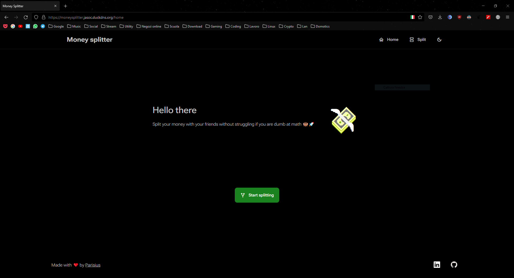
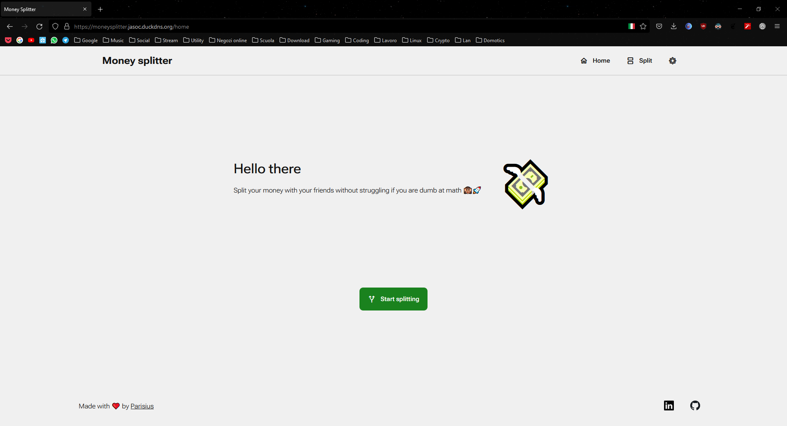
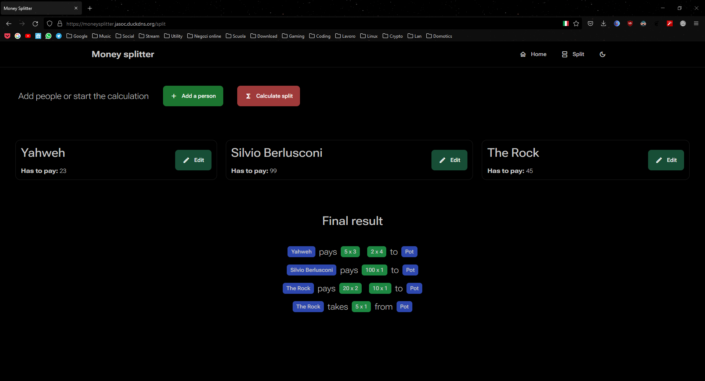
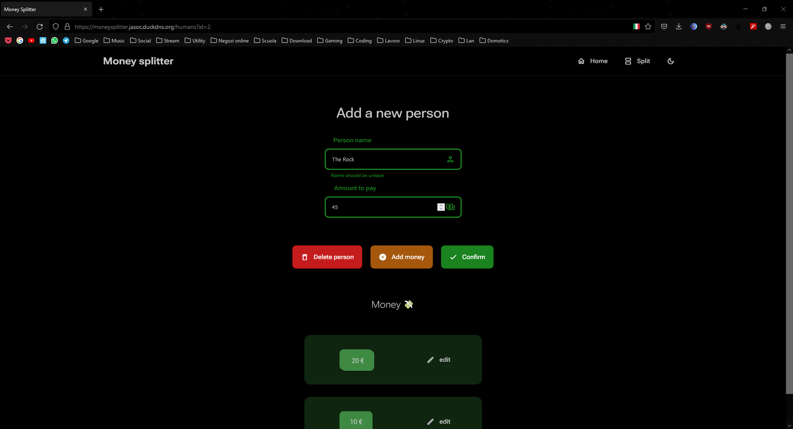

# __Money splitter__

## __A webapp for split money on the go 💵💲🙉__

Have you ever struggle when you go out with your friends, you pay different amounts of money at the restaurant, and you pay all in cash, and get lil crazy when you try to do the math with the money to fix the rest for all of you? This website is for you!

## __WTF?!__

Yes. Take it or leave.

## __The repo__

This is kind of a mono-repo. The structure is:

| Folder         | Description                                                                                |
|:-------------- | ------------------------------------------------------------------------------------------:|
| __/splitter__  | This folder contains the module that runs the algorithm behind the splitting of the money. |
| __/webapp__    | This folder contains the webapp written in Lit, using rollup, postCSS webpack.             |
| __/tests__     | Tests. Actually very few.                                                                  |
| __/scripts__   | Some utility scripts                                                                       |
| __/resources__ | Various files.                                                                             |

## __Show me__

__Dark mode__

__Light mode__

You can edit all the people

And edit all single money they possess

## __About__

 This project was made for fun and for learn Lit. And actually for solve a very stupid problem that could help someone (maybe).